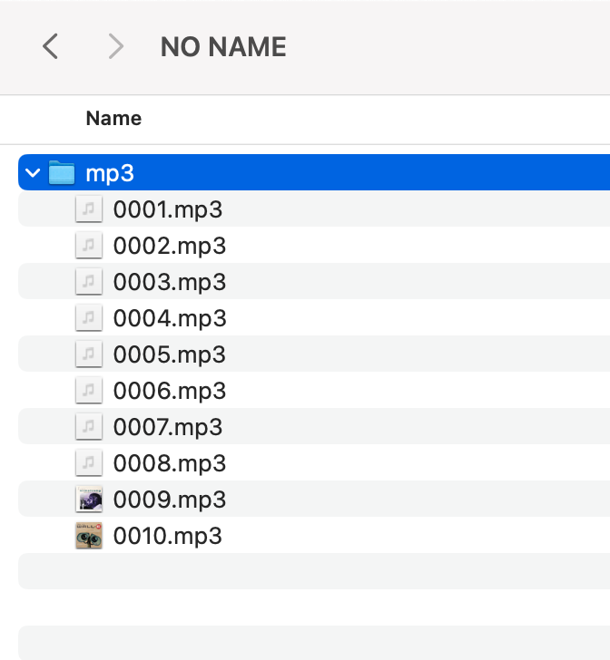

# Overview
This repo contains code, PCB files, and some 3D files for a WALL-E robot. The robot is controlled by an ESP32 microcontroller with PlayStation Navigation controllers. 3D files can be found under the `Mechanical` folder. The PCB files can be found under the `PCB Files`. The code can be found under the `src` folder. 

This readme file contains information on setting up and using WALL-E, and there are several videos in the `Docs` folder that give examples.

The code is written as an Arduino sketch, but has many C++ files and classes. The custom library code is located in the `src` folder of the walle sketch and is organized into the following folders:
- `audio`: Contains the code for the audio player.
- `display`: Contains the code for the display and animations.
- `motion`: Contains the code for the motion animations.
- `button`: Contains the code for the button handling.
- `controller`: Contains the code for the controller handling.
- `stats`: Contains a simple stats class mostly used for debugging.

Additionally, the root of the `src` folder contains the main sketch file, `walle.ino`, which is the entry point for the program. It also contains several files to help configure WALL-E:
- `config.hpp`: Contains the configuration for the audio player, display, and controller.
- `display_animations.hpp` and `display_animations.cpp`: Contains code for programatically defining display animations.
- `motion_animations.hpp` and `motion_animations.cpp`: Contains code for programatically defining motion animations.

# Button Mapping
This image can be found in `Docs/Images`.


# Setting up Arduino IDE
This project uses a special board package for the ESP32 called [Bluepad32](https://github.com/ricardoquesada/bluepad32). To install it, you need to add this board to your Arduino IDE. The abreviated steps to do this are below. See [this doc page](https://bluepad32.readthedocs.io/en/latest/plat_arduino/) for more detailed instructions.
1. Open the Arduino IDE settings and add the following two URLs to the "Additional Boards Manager URLs" field: 
`https://raw.githubusercontent.com/espressif/arduino-esp32/gh-pages/package_esp32_index.json`
`https://raw.githubusercontent.com/ricardoquesada/esp32-arduino-lib-builder/master/bluepad32_files/package_esp32_bluepad32_index.json`
2. Install the ESP32 and ESP32 Bluepad32 boards from the Boards Manager.
3. Select the `ESP32-WROOM-DA Module` from the Tools > Board > esp32_bluepad32 menu.

You will also need to install the following libraries:
- Adafruit PWM Servo Driver Library
- DFPlayer Mini Mp3 by Makuna
- Ramp
- ServoESP32
- TFT_eSPI

You will need to setup the TFT_eSPI library with the correct config. To do this, create a `TFT_eSPI_Setups` folder in your Arduino libraries folder (usualy in `~/Documents/Arduino/libraries/`), then copy the `TFT_eSPI_walle_setup.h` file in `src/display/` to this new folder. After that, open User_Setup_Select.h in the `/TFT_eSPI/` library folder and comment out the current user config (`User_Setup.h` by default), then add the following line:
```cpp
 #include <../TFT_eSPI_Setups/TFT_eSPI_walle_setup.h>
 ```

After this, you should be able to compile and upload the code to the ESP32. Make sure WALL-E is powered on before plugging in the USB cable to the ESP32, otherwise the USB port will attempt to power the servo motors and will likely trip your USB port's overcurrent protection.

Note that the Arduino IDE will throw some warnings related to "converting a string constant to 'char*'" as well as some bluepad and eSPI_TFT warnings. These can be ignored.

# Adding new sounds
New sounds can be added to the audio player's SD card as `.mp3` files. Audio tracks must be labeled as numbers with the format `0001.mp3`, `0002.mp3`, etc. The number of the audio track is the index that will be used to play the sound. You can configure the audio player sounds and keybindings in the `config.hpp` file. Here is what the folder structure on the SD card should look like:



For instance, if you add a track `0011.mp3` and you wish to bind it to the `L2 + Up` button, you would add the following line to the `config.hpp` file:
```cpp
const int audio_track_selection_list[] = {
    TRACK_INDEX_EVE_1, // Up
    TRACK_INDEX_TADA, // Right
    TRACK_INDEX_SCREAM, // Down
    TRACK_INDEX_WALLE_1, // Left
    11, // L2 + Up <<<<<<<<<<<<<<<<<<<<<<<< CHANGED TRACK 
    TRACK_INDEX_EVE_3, // L2 + Right
    TRACK_DEFINE_DANCING, // L2 + Down
    TRACK_LA_VIE_EN_ROSE, // L2 + Left
};
```

Sounds which are bound to a button can be added to keyframes in motion animations. 

Similarly, you could add it to the audio_track_random_list. 

```cpp
// Tracks in this array will be selected randomly by the playRandomTrack() function
const int audio_track_random_list[] = {
    TRACK_INDEX_EVE_1,
    TRACK_INDEX_EVE_2,
    TRACK_INDEX_EVE_3,
    TRACK_INDEX_WALLE_1,
    TRACK_INDEX_SCREAM,
    TRACK_INDEX_TADA,
    11 // <<<<<<<<<<<<<<<<<<<<<<<< ADDED TRACK
};
```

# Adding solar animations
The steps to add a solar animation are as follows:
1. Declare your variable name in display_animations.hpp:
```cpp
extern AnimateLeve animate_display_startup;
...
// Add your variable name here
extern AnimateLevel my_animation;
```
2. Define your vairable in display_animations.cpp:
```cpp
AnimateLevel animate_display_startup = AnimateLevel();
...
// Define your variable here
AnimateLevel my_animation = AnimateLevel();
```
3. Create a setup_my_animation() function in display_animations.cpp:
```cpp
void setup_my_animation() {
  my_animation.addKeyframe(0, 0);
  my_animation.addKeyframe(1000, 1);
  ...
}
```
4. Add your setup_my_animation() function to the setup_animations() function in display_animations.cpp:
```cpp
void setup_animations() {
  setup_startup();
  ...
  // Add your setup_my_animation() function here
  setup_my_animation();
}
```

Now your variable ```my_animation``` will be available to use in the main sketch. 

### Notes
- A keyframe with a single change will perform that change at the beginning of the keyframe. For example, if 2 bars are on and you request 3 to be on with a duration of 1 second, the 3rd bar will turn on immediately and the keyframe will wait for 1 second to complete. If you have two or more changes in a keyframe, the changes will be evenly distributed throughout the duration of the keyframe, ending with a change. For example, if 2 bars are on and you request 5 to be on with a duration of 1 second, the 3rd bar will turn on immediately, the 4th bar will turn on after 0.5 seconds, and the 5th bar will turn on after 1 second.
- The sun's status is always evaluated at the beginning of a keyframe.

# Adding motion animations
The steps to add a motion animation are as follows:
1. Declare your variable name in motion_animations.hpp:
```cpp
namespace MotionAnimations {
    // Add custom animations here:
    extern ServoAnimation my_animation;

    // Rest of namespace ...
}
```
2. Define your vairable in motion_animations.cpp:
```cpp
namespace MotionAnimations {
    // Define new animations here

    ServoAnimation my_animation = ServoAnimation();

    // Rest of namespace ...
}
```
3. Create a setup_my_animation() function in motion_animations.cpp. Keyframes are created one at a time and then added to the previously created animation. Create a keyframe with `ServoKeyframe *my_keyframe = new ServoKeyframe(duration_ms);`. Add the servo positions to the keyframe with `my_keyframe->add_servo_scaler(servo_ptr, position);`. Add the keyframe to the animation with `my_animation.addKeyframe(my_keyframe);`. Servos are addressed by their name. There is a #define for each servo. E.g, to get the left eye servo you would use `servos.map[SERVO_EYE_LEFT_NAME]` For example:
```cpp
// Create setup functions for each animation.
// NOTE: Don't forget to call these functions in setup_animations().
void setup_my_animation() {
    // Rotate eyes in opposite directions
    ServoKeyframe *my_keyframe1 = new ServoKeyframe(1000);
    my_keyframe->add_servo_scaler(servos.map[SERVO_EYE_LEFT_NAME], 0.75);
    my_keyframe->add_servo_scaler(servos.map[SERVO_EYE_RIGHT_NAME], -0.75);
    
    // Pause for 3 seconds
    ServoKeyframe *my_keyframe2 = new ServoKeyframe(3000);

    // Return the eyes to their original position
    ServoKeyframe *my_keyframe3 = new ServoKeyframe(1000);
    my_keyframe->add_servo_scaler(servos.map[SERVO_EYE_LEFT_NAME], 0);
    my_keyframe->add_servo_scaler(servos.map[SERVO_EYE_RIGHT_NAME], 0);

    // Add the keyframes to the animation
    my_animation.add_keyframe(my_keyframe1);
    my_animation.add_keyframe(my_keyframe2);
    my_animation.add_keyframe(my_keyframe3);
}
```
4. Add your setup_my_animation() function to the setup_animations() function in motion_animations.cpp:
```cpp
void setup_animations(ServoContext servos) {
    // This function should get called in the main setup() function. It calls all animation setup functions for use in
    // the main sketch.

    // Add setup functions for new animations here
    setup_my_animation();

    // Rest of animation setups...
}
```
5. Play the animation with `servo_player.play(&MotionAnimations::my_animation);`. Alternatively, you can add the animation to the `head_animations` array in the main sketch to bind it to a button press:
```cpp
ServoAnimation         *head_animations[] = {
    &MotionAnimations::my_animation, // Up
    nullptr,      // Right
    nullptr,      // Down
    nullptr,      // Left
    nullptr,      // L2 + Up
    nullptr,      // L2 + Right
    nullptr,      // L2 + Down
    nullptr       // L2 + Left
};
```